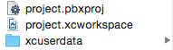

  


[](https://opensource.org/licenses/MIT)

Test application that asynchronously fetches address book and syncs contacts with remote server (multithreading).

## Features

- [x] Fetch Address Book contacts and persist them locally using `Realm` database
- [x] Asynchronously sync local contacts with remote server, chunck by chunck in background threads to keep main thread fully available for UI rendering

## Requirements

- iOS 9.0+
- Xcode 8.0+
- Swift 3.0+

### Persistent Storage
This project is aimed at testing and showing how to use `Realm` as an alternative to `CoreData`. It is used for data persistence over time, a special highlight is dedicated to its multithreading capabilities while syncing contacts with remote server, leaving room for the Main Thread to focus on UI rendering. 

### Dependency Management
Contact Syncing relies on **two dependency managers**. It is usually best practice to centralize dependency management into only one of them — the **reason to use both CocoaPods and Carthage** in Contact Syncing was its necessity to import some of the libraries only supporting the latter (e.g. `DataSource` and `Ethanol`). 

#### CocoaPods
[CocoaPods](https://cocoapods.org "CocoaPods Homepage") is the most famous and widely used dependency manager in iOS. When imported, the libraries are added to your repository in a _centralized_ fashion. There is no need to update the **pods** after cloning the repository as they are already included in the workspace.
Most of the libraries are imported using CocoaPods:

1. [**RealmSwift**](https://github.com/realm/realm-cocoa/tree/master/RealmSwift) (cocoapods) - Realm is a mobile database: a replacement for Core Data & SQLite.

##### Update
Run the following command in order to update the Pods: 
`pod udpate`

##### Add Dependency
All dependencies are added in the entry point file named `Podfile`. In order to add any new dependency, just add a new entry and perform an Update (see above). 

#### Carthage
[Carthage](https://github.com/Carthage/Carthage "Carthage Homepage") is intended to be the simplest way to add frameworks to your Cocoa application. It is a _decentralized_ dependency manager that will create separate `xcodebuild` libraries, it is the responsability of the developer to import them. Once imported, the libraries are not actually part of your repository; consequently, it is always needed to fetch them after the project is cloned.

1. [**ReactiveCocoa**](https://github.com/ReactiveCocoa/ReactiveCocoa) - ReactiveCocoa (RAC) is a Cocoa framework inspired by Functional Reactive Programming. It provides APIs for composing and transforming streams of values over time. 
2. [**Result**](https://github.com/antitypical/Result) - This is a Swift µframework providing Result<Value, Error>, which is used with reactive Cocoa for handling event results in a better way.
3. [**DataSource**](https://github.com/Vadim-Yelagin/DataSource) - DataSource is a Swift framework that helps you specify, display and manipulate sectioned collections of items in UITableview and UICollectionView in an MVVM (Model-View-ViewModel) fashion without having to deal with index mapping or writing repetitive and error-prone code to handle and display changes of those collections.
5. [**Ethanol**](https://github.com/Fueled) - (Contacts/Utilities) Developed and managed by **Fueled**. Ethanol is used in many places throughout the project for utility functions and reusable code, here Address Book contacts fetch most notably.

##### Update
Note that you need to update **carthage** in order to be able to compile the project. This can be achieved by running the following command in the project: 
`carthage update --use-submodules --no-build`

When encountering update/setup issues, it can be useful to reset all dependencies by running the following command (no risk involved):
`git submodule foreach --recursive "git reset --hard && git clean -xqfd" && git submodule update --init —recursive`

##### Add Dependency
The process might seem trivial but is actually more complicated than it seemed because of our usage of non-builtin schemes name (Snapshot, Staging and Production). This section describes how to do it, using the example of adding `ethanol-social` into the workspace.  

_The screenshots in the following sections all reference the project `EthanolExamples` (Or a different project name), but it's the same as if it was `Contact Syncing`._

###### Add it via Carthage

1. Add `ethanol-social` into the Cartfile. For example, the result will be:

```
# <Current dependencies...>
github "Fueled/ethanol-social" ~> 0.1
```

2. Run `carthage update --use-submodules --no-build`
This will create a new folder in the relative directory `Carthage/Checkouts` called `ethanol-social`

###### Add it into the workspace

1. Locate the .xcodeproj package from `ethanol-social`:  
  
Drag and drop it into the workspace:  


2. _This step and the next one is sometimes not necessarily, but is most of the times. In any case, the end result is the same_  
Open the workspace `ContactSyncing.xcworkspace`, and go to the `Link Binary with Libraries` build phase for the Contact Syncing target. To do so, first click on `Contact Syncing` project, then click on the target `Contact Syncing`, go to `General`, and finally expand `Link Binary with Libraries`.  
  
From there, click the "+" button at the bottom and select the framework from the dependency you're adding (In our case, `EthanolSocial.framework`):  
  
_Note that if xcode was properly setting up everything, we would only need to do the previous step and step #4._

3. You now have to remove it from there, in `Link Binary with Libraries`. The purpose of adding it in the first place was so xcode adds a reference to it in the `Frameworks` folder.  
  
Before you continue, please make sure that the the framework is there, with a missing icon.
In our case, here what it looks like:  
  

4. Now, similarly to the `Link Binary with Libraries`, expand the `Embedded Binaries` build phase right above it. From there, click the "+" button, and select the framework from the `Frameworks` folder:
  
The framework should then show up both in `Embedded Binaries` and in `Link Binary with Libraries`:


5. Now, we need to edit the project file so that everything works for other people when they fetch it later on. Do to so, first right-click on `EthanolExample` in the workspace and click on `Show in Finder`  
  
From the finder window that shows up, right-click on the `ContactSyncing.xcodeproj` and click on `Show Package Contents`.  
  
From then, locate the file `project.pbxproj` and open it with your favorite text editor.  


6. Search for the framework you added on step #2 (In our case, `EthanolSocial.framework`). After a few hits, you should find a line that looks like this one:  

```
F43F75DA1B9F05C200954745 /* EthanolSocial.framework */ = {isa = PBXFileReference; lastKnownFileType = wrapper.framework; name = EthanolSocial.framework; path = "../ethanol-social/build/Debug-iphoneos/EthanolSocial.framework"; sourceTree = "<group>"; };
```

See that ugly `path` reference? That's what we're going to fix. What's happening here is that xcode has found our framework but wants to us the result as if it was created via `carthage build`, which is not what we want, since we want to build it with xcode directly.  
In order to fix it, we need to tell xcode to find the framework into the build directory for the current workspace (As everything built as part of the workspace goes into the same folder). This folder changes for every project/workspace, and is indicated by the xcodebuild environment variable `BUILT_PRODUCTS_DIR`.
However, there is something else that needs to be taken into account: the frameworks will be built in only 2 different built folder path, depending on which scheme they're being built is either `Debug` (Which corresponds to our `Debug` scheme) or `Release` (Which corresponds to all the other schemes, `Snapshot`, `Staging`, `Release` and `Production`). Our project will be built into a specific built folder path for each scheme. The `WORKSPACE_FRAMEWORK_BUILT_PRODUCTS_DIR` environment solves that issue by pointing to `Debug` built folder path in the `Debug` scheme, and to the `Release` built folder path in all other schemes, allowing to correctly reference the built frameworks for each scheme.
What we need to do then is this: change `sourceTree` so that it's relative to `WORKSPACE_FRAMEWORK_BUILT_PRODUCTS_DIR`, and change the path so it's just the name of the framework. In our example, the line becomes:

```
F43F75DA1B9F05C200954745 /* EthanolSocial.framework */ = {isa = PBXFileReference; lastKnownFileType = wrapper.framework; name = EthanolSocial.framework; path = EthanolSocial.framework; sourceTree = WORKSPACE_FRAMEWORK_BUILT_PRODUCTS_DIR; };
```

You can then save the file and the project should run and compile fine.

7. Last step, is to remove a parameter that xcode automatically adds when adding frameworks this way, and that creates a warning on compilation if left as-is. The parameter  can be found in the `Build Settings` tab, and is called `Framework Search Paths`. To remove the parameter, make sure you select the target, then highlight it, and hit the remove key on your keyboard. This should change the parameter from being bold to normal.

## License

SoundWave is available under the MIT license. See the LICENSE file for more info.